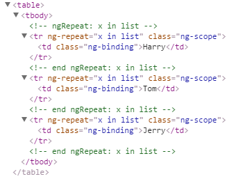

# 重复语句 `ng-repeat`

本节将讲述如何使用`ng-repeat`对一个列表的数据进行遍历并显示出来。

首先，我们准备如下的数据。这是一个包括三个`object`的`array`。

```javascript
$scope.list = [
    {
        name: "Harry"
    },
    {
        name: "Tom"
    },
    {
        name: "Jerry"
    }
];
```

下面，我们将这些数据显示在HTML的一个表格中：

```html
<table>
    <tr ng-repeat="x in list">
        <td>{{x.name}}</td>
    </tr>
</table>
```

运行结果


为了更好的查看具体的运行效果，我们可以查看下最终生成的HTML代码。



从源代码可以看出来，`ng-repeat`直接将其所在的`<tr>`元素根据`list`的长度复制了3次。并将相应的数据填充了进去。

## $index

在实际的使用场景中，如果我们使用一个表格来管理信息，那么可能表格的每一行都会有一些对应的操作功能（如编辑、删除）等。那么，我们如何在`ng-repeat`中知道是哪一行被点击了呢？

AngularJS提供了`$index`这个字段让我们实现这个功能。

下面，我们来看看使用`$index`的例子：

在`app.js`中，对`onClick`函数进行一些改造，让它能够获取传入的数据：

```javascript
$scope.onClick = function (index) {
    alert("点击了第"+index+"行的按钮");
};
```

将刚才的表格也进行一些改造：

```html
<table>
    <tr ng-repeat="x in list">
        <td>{{x.name}}</td>
        <td><input type="button" value="我是第{{$index}}行的按钮"
              ng-click="onClick($index)"></td>
    </tr>
</table>
```

刷新页面后，让我们点击第一个按钮，效果如下：


这样，我们就可以明确的知道用户点击了哪一行了！

另外，值得注意的是，`$index`是从`0`开始计算的哟！
